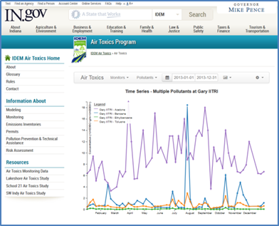
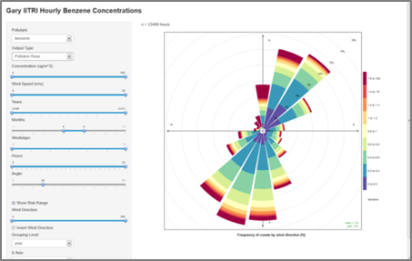
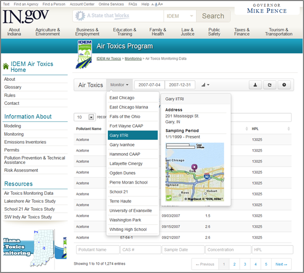
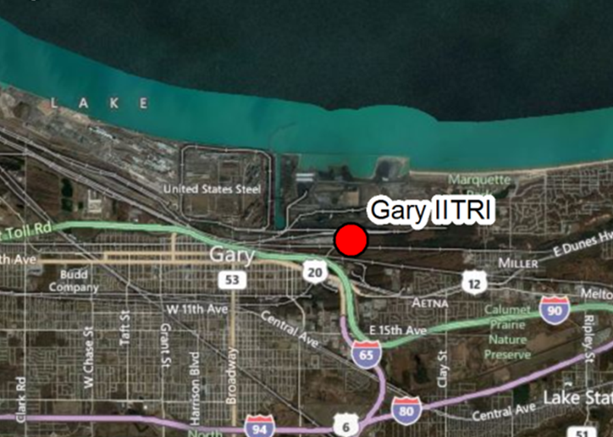

Tools for Creating Interactive Web Applications for Environmental Data
========================================================
author: Eric Bailey & Kali Frost
date: 11/24/2014

The R Environment
========================================================

* *R* is a programming language and software environment for statistical computing and graphics
* It is similar to programs such as SAS, SPSS, and STATA 
* R is widely used in academia and quickly gaining traction in government and industry
* There are thousands of add-on packages that you can use with R
 + Special statistical functions
 + Mapping
 + Data manipulation
 + Graphing and visualization packages

Shiny Web Framework
========================================================

* *Shiny* is an add-on package for R that allows for the easy development of interactive web applications
* Need some familiarity with R, but does not require knowledge of typical web development software such as HTML, CSS, or JavaScript
* Both R and Shiny (and many other useful packages) are free

***
Your R Code

Shiny

Why Do We Use R
======================================================

* R has increased our efficiency by leaps and bounds, due to customization and automation of repeated tasks
* Because R is open-source, people in the environmental field have created dozens of <a href="http://cran.r-project.org/web/views/Environmetrics.html" target="_blank">packages</a> to streamline tasks that we do regularly
* Just a few examples:
 + <a href="http://cran.r-project.org/web/packages/openair/index.html" target="_blank">openair</a>: provides numerous tools to analyze, interpret and understand air pollution time series data 
 + <a href="http://soilwater.r-forge.r-project.org/" target="_blank">Soilwaterfun</a>: package providing soil water retention and soil hydraulic conductivity functions 
 + <a href="http://cran.r-project.org/web/packages/wq/index.html" target="_blank">wq</a>: Processing and exploration of data from monitoring programs for aquatic ecosystems, with a focus on time series data for physical and chemical properties of water and plankton
 
Why Do We Use R and Shiny?
====================================================

* We have used R and Shiny to create web applications for communication with internal and external stakeholders
 + Industry
 + Upper Management
 + Research Partners
 + The Public
 
 ***
 
 
 

US Steel
==================================================
* High concentrations of benzene at a monitor near US Steel
* We created an interactive application to help us quickly subset and display air toxics data associated with the monitor near their facility
* One of our first apps (<a href="http://idemappp01vl.state.in.us:3838/US_Steel/" target="_blank">here</a>) , able to put it together in just a couple of days

***

Indiana Metals Data Explorer
=================================================
* 2000 - 2013, 1-in-6 day metals data from air quality sites around the state
 + TSP, PM 10, PM 2.5
 + As, Be, Cd, Cr, Pb, Mn, Ni
* Xact Monitor Data for 2012-2013 near US Steel facility
* Emissions bubble maps for 2002, 2005, 2008 and 2011 National Emissions Inventory (NEI) metals data
* <a href="https://kfrost.shinyapps.io/INmetals/" target="_blank">Found here</a> (does not work in anything older than IE 10, also works in Firefox, Chrome, Safari)

ToxWatch Public Tool and Manager Dashboard
===============================================
* Input
 + 15 years of sample data
 + 1-in-6 day sampling (TO-14 and TO-15) of 62 pollutants
 + 9-12 monitors at any given time
 + Stored in Oracle database
 + User selects any combination of pollutants/monitors/dates
* Public Tool (<a href="http://www.in.gov/idem/pages/airstats/?site=toxics&style=toxics" target="_blank">here</a>) 
* Manager's Dashboard (<a href="http://idemappp01vl.state.in.us:3838/ToxicsDashboard/" target="_blank">here</a>)

Potential benefits of these tools:
===============================================
* Apps can pull in data directly from a database, reduces user error
* Transformation on data made using _transparent_ & replicable code
* Allow users (internal or public) to manipulate and view data themselves, reducing need for data requests
 + Can also create custom downloads of data
* Can block queries on datasets that are too small or contain too many outliers, etc (i.e. may be inappropriate for statistical inference)

OAQ Data Analysis Contact Info
==============================================
* Eric Bailey
 + ebailey@idem.in.gov

* Nathan Byers
 + nybers@idem.in.gov
 
* Kali Frost
 + kfrost@idem.in.gov
 
* Brian Wolff, Project Management Section Chief
 + bwolff@idem.in.gov

 

